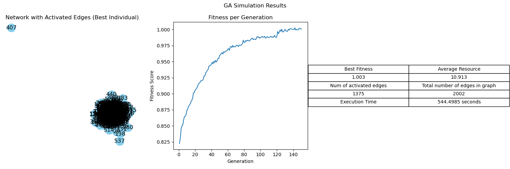
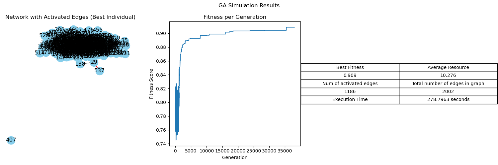
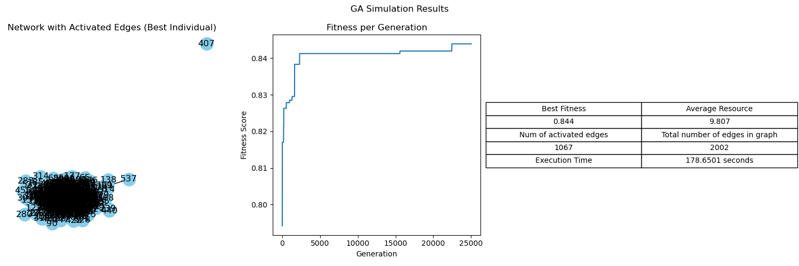

# crisp-heuristics
Optimizing Resource Sharing Graphs Using Heuristic Algorithms

"simulation1.py" contains a graph simulation comparing our Genetic Algorithm, Simulated Annealing, and Particle Swarming Optimization. 

The results are as follows:

